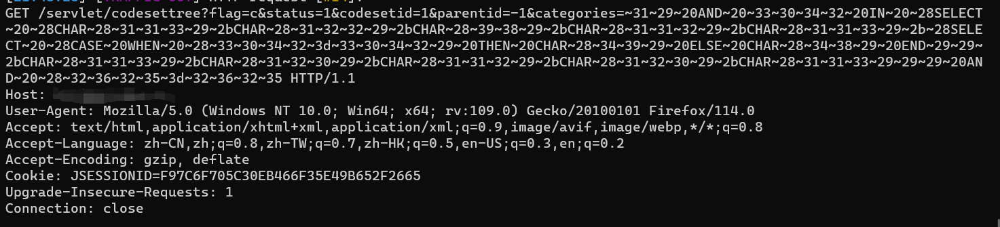

# HrmsTool-tamper
郑重声明：文中所涉及的技术、思路和工具仅供以安全为目的的学习交流使用，任何人不得将其用于非法用途以及盈利等目的，否则后果自行承担。

脚本适用于宏景HCM的SQL注入复现

复现CNVD-2023-08743部分payload不会打，遂借助脚本及sqlmap实现

将HrmsTool与sqlmap进行联动

感谢[[vaycore](https://github.com/vaycore)]提供的 [HrmsTool](https://github.com/vaycore/HrmsTool)

## 食用方式

修改tamper配置

```
#ava环境路径（java 1.8）
#如java_path = r"D:\java.exe"
java_path = r"path to\java.exe"
#HrmsTool.jar路径
#如hrms_tool_path = r"D:\HrmsTool.jar"
hrms_tool_path = r"path to\HrmsTool.jar"
```

将=HrmsTool-tamper.py放入sqlmap的tamper目录下

sqlmap

```
sqlmap.py --tamper=HrmsTool-tamper 
```

举个栗子



实际复现过程中发现部分payload在没有'-- '时会出现注入失败的情况
于是改了下脚本，在每个payload末尾自动加入'-- '

不需要加入'-- '时，注释掉这个就行
```
payload += "-- "
```

## 哦豁
实际用下来好像没啥叼用，就这样吧
欢迎各位师傅提交 Issue 和 Pull requests，一起完善
